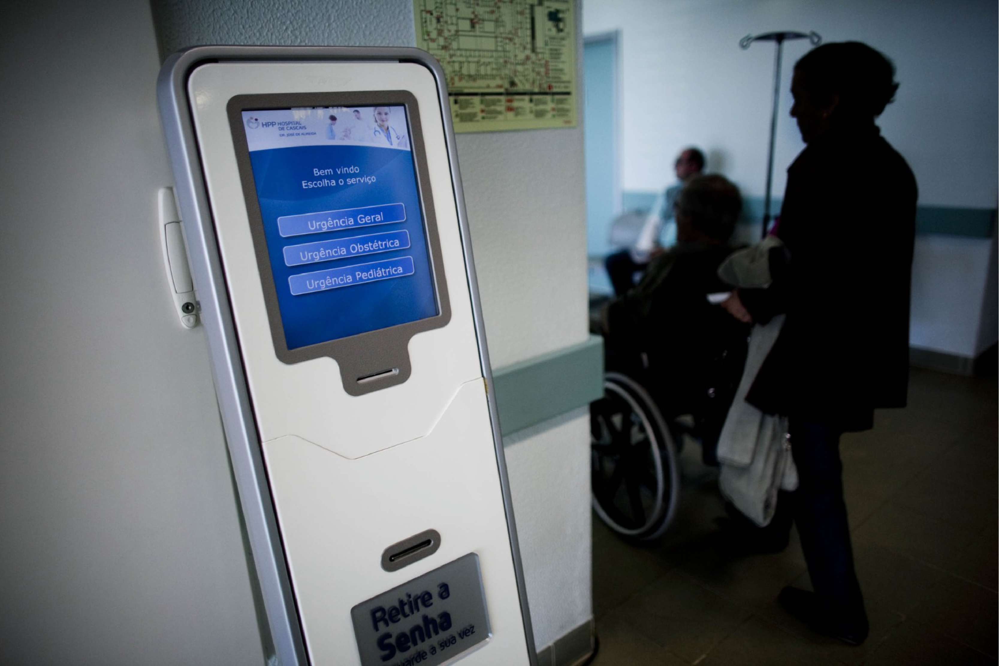
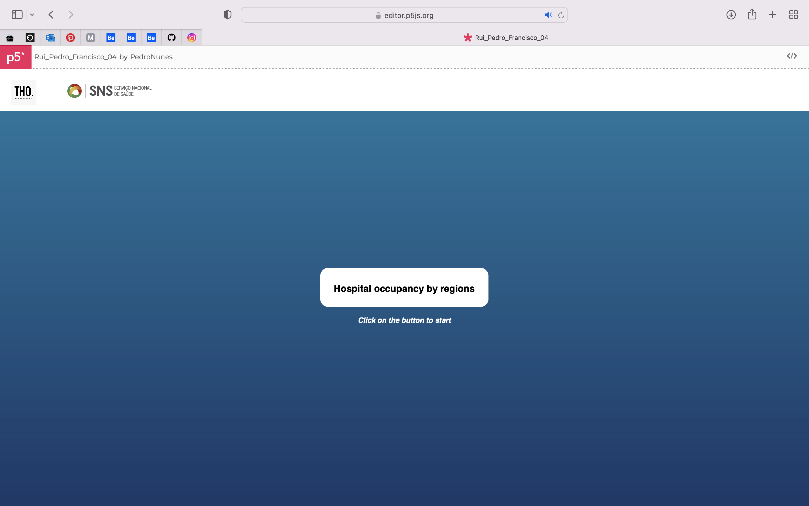
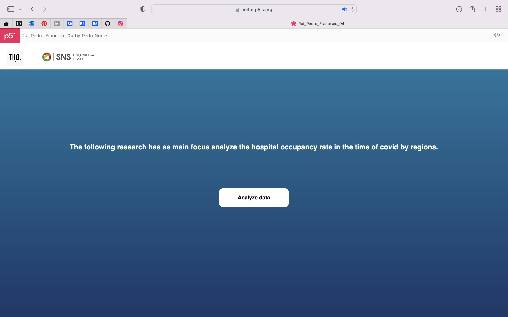
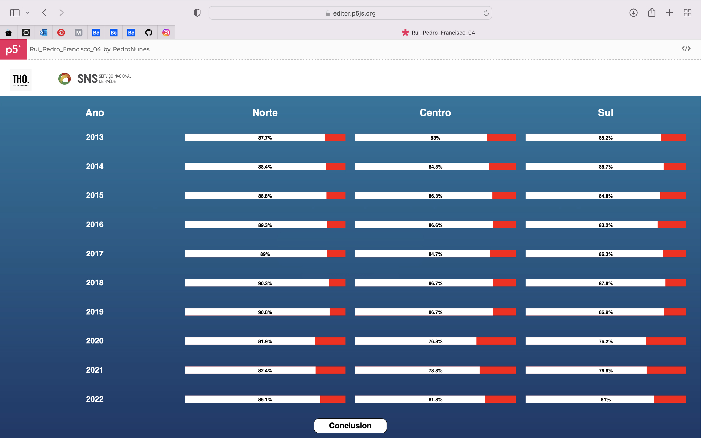
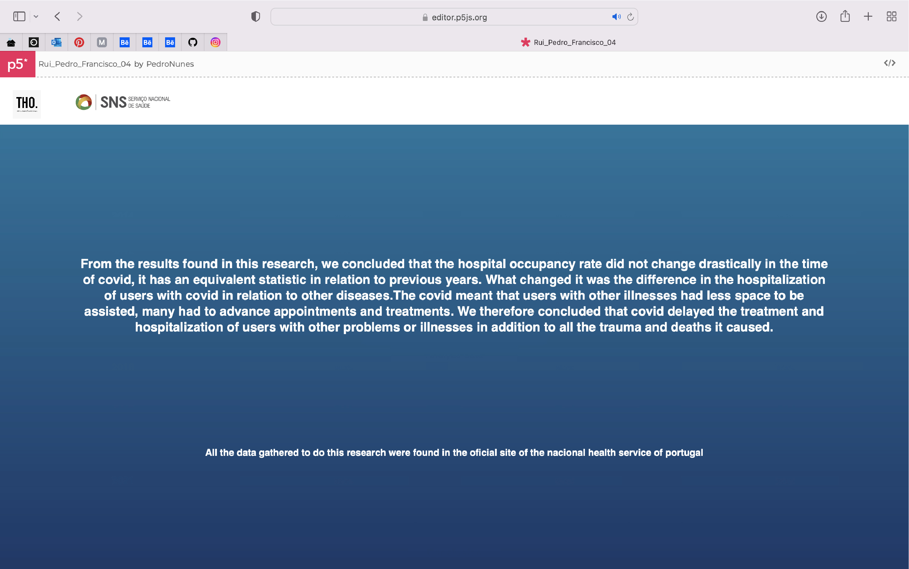

# Taxa de Ocupação Hospitalar

Neste projeto, foi proposto criar uma forma de representação de dados desenvolvido em p5*js.

Após a formação do grupo de trabalho realizamos uma reunião para discussão da ideia a retratar. De seguida, foram realizados vários possíveis esboços de representação visual do projeto, sempre discutindo e partilhando ideias com o docente. Fomos desenvolvendo o código conforme fomos adquirindo os conhecimentos no decorrer do semestre durante as aulas. Tendo a ideia de representação fechada começamos a trabalhar afuniladamente no código tentando obter a sua perfeita visualização. 

Como tema selecionamos a taxa de ocupação hospitalar por regiões (Norte, Centro e Sul) a nível nacional, tendo como principal foco retratar a forma como os dados em tempo de covid se comportaram. Através do website [Pordata](https://www.pordata.pt/portugal/taxa+de+ocupacao+nos+hospitais-3666) conseguimos selecionar o tema que queríamos abordar, contudo os dados para a concretização do projeto foram retirados apartir do website [SNS](https://transparencia.sns.gov.pt/explore/dataset/ocupacao-do-internamento/table/?flg=pt&disjunctive.regiao&disjunctive.instituicao&sort=tempo).

De forma original e inovadora, decidimos representar estes dados numa interface de máquina de senha, tal como podemos observar e experênciar em alguns hospitais , algo que a comunidade já está familiarizada e de fácil compreensão para o utilizador. Para desenvolvimento do teste de vizualização utilizamos o Adobe Illustrator. 

Esta interface é composta por um fundo de degradê azul que transmite sensações de harmonia e tranquilidade. No cabeçalho podemos observar dois logótipos, um do serviço nacional de saúde e o "THO" Taxa de Ocupação Hospitalar , um logo representativo do nosso projeto, realizado por nós. 

Começouse-se por elaborar a tabela de dados em Microsoft Excel para posteriormente ser representada no p5*js. 
[Tabela de Dados](https://myipleiria-my.sharepoint.com/:x:/g/personal/3200745_my_ipleiria_pt/EZTWIq4904FJjrhskEKAnlABkGlDnHJlkFTerE1lwAf6bw?e=a0Wohu)

Na primeira página , observamos um botão centrado e legendado que quando clicado somos automaticamente rederecionados para a página seguinte  onde temos uma breve descrição alusiva e informativa do que estão prestes a ver, carregando em "Analyze data" aparece nada mais, nada menos do que a tabela para se analizar a taxa de ocupação hospitalar em tempo de covid-19 por três regiões de Portugal ao longo dos anos.  O conceito da tabelha apresentada refere-se aos termometros, mas este desenvolvido de forma muito simplificada. 

De forma conclusiva ao projeto, podemos ainda clicar no botão que se segue à tabela, este dará acesso final ao texto conclusivo do estudo realizado. 

Link para editor do projeto: [editor](https://editor.p5js.org/PedroNunes/sketches/w1RFvDw30)
Link para visualização fullscreen do projeto: [projeto fullscreen](https://editor.p5js.org/PedroNunes/full/w1RFvDw30)

Francisco Pereira 3200745
Pedro Nunes 3200694
Rui Pedro Mata 3200700